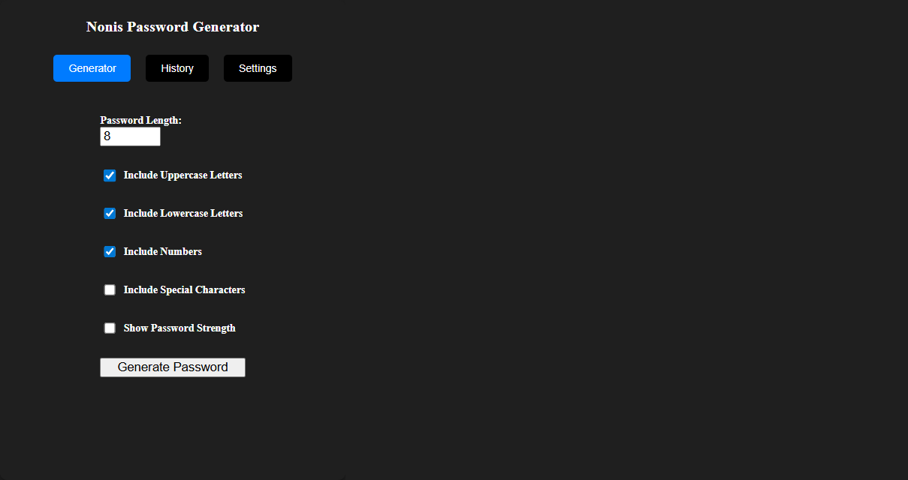
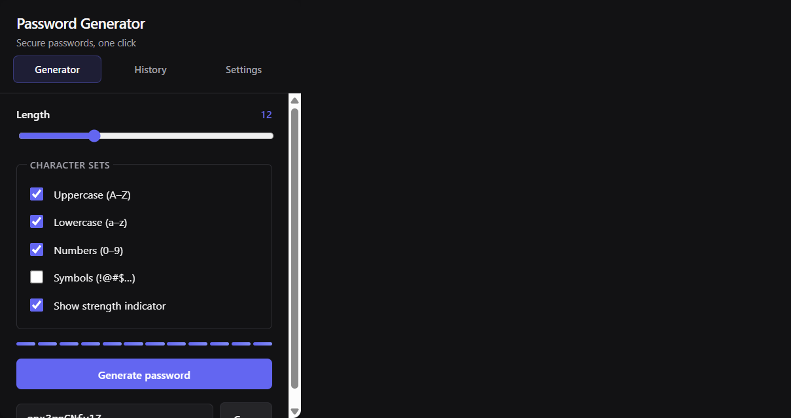

# Password Generator

Manifest V3 Chrome extension — configurable password generation, clipboard copy, and optional history persisted via `chrome.storage.sync`.

| Before | After |
|--------|-------|
|  |  |

## Features

- Length slider (4–32) with character-set toggles (upper, lower, numbers, symbols)
- Password presets: Banking, WiFi, PIN
- Passphrase mode — diceware-style random words (4–8 words)
- Exclude ambiguous characters (`0`, `O`, `1`, `l`, `I`) via Settings
- Visual strength indicator
- One-click copy with feedback
- History tab with copy, export (`.txt`), and clear (opt-in via Settings)
- Light / dark theme (persisted in `chrome.storage`)
- Keyboard shortcuts (customize under `chrome://extensions/shortcuts`)
- Spec-driven test suite — behaviors documented in [`docs/BEHAVIOR.md`](./docs/BEHAVIOR.md)

## Keyboard shortcuts

| Shortcut | Action |
|----------|--------|
| `Ctrl+Shift+P` (`Cmd+Shift+P` on Mac) | Open popup |
| `Ctrl+Shift+G` (`Cmd+Shift+G` on Mac) | Regenerate password (when popup is open) |

To change shortcuts: open `chrome://extensions/shortcuts` and find **Password Generator**.

## Install (development)

```bash
git clone https://github.com/GeorgeNonis/pwd-generator-extension.git
cd pwd-generator-extension
npm install
npm run build
```

Load in Chrome:

1. Open `chrome://extensions`
2. Enable **Developer mode**
3. **Load unpacked** → select the **`dist`** folder (not `dist/js`)

## Development

```bash
npm run watch    # rebuild on change — reload extension after each build
npm test         # run behavior specs (see docs/BEHAVIOR.md)
```

Preview UI in a browser (chrome API mocked): open `dist/js/preview.html` via a local server after build.

## Stack

React 18 · TypeScript · Redux Toolkit · Webpack · Manifest V3 · Chrome Storage API · Jest / Testing Library

## Quality

Password generation uses `crypto.getRandomValues`. Core logic is extracted to `src/lib/password.ts` with unit tests; UI behaviors map 1:1 to specs in `docs/BEHAVIOR.md`.

## Roadmap

See [`ROADMAP.md`](./ROADMAP.md) for planned improvements (Chrome Web Store, passphrase mode, E2E).
